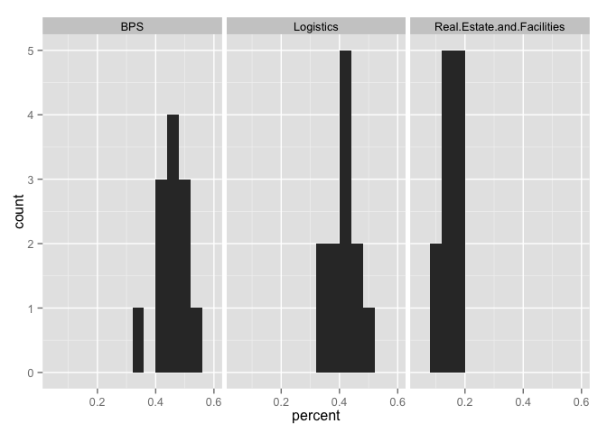
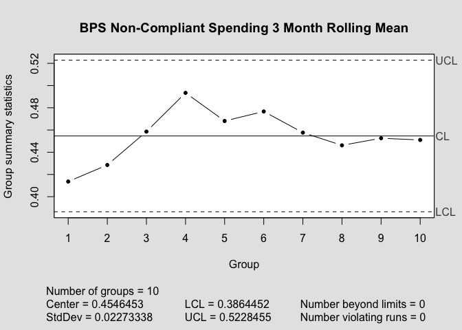
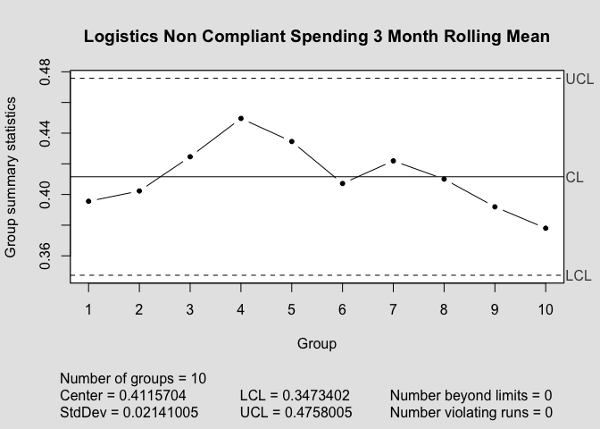
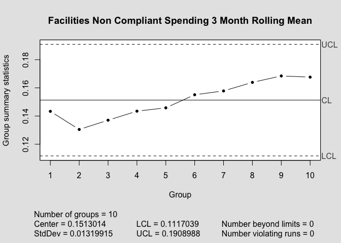
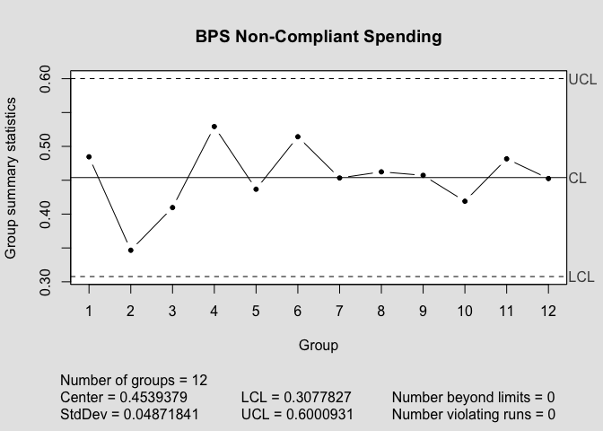
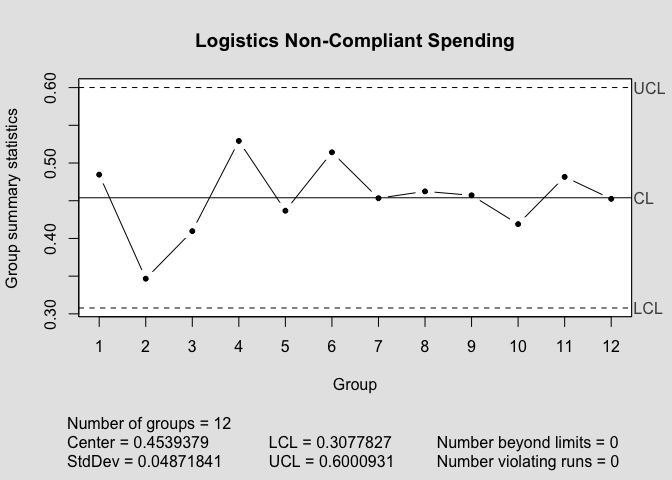

    #libraries
    require(plyr)
    require(dplyr)
    require(reshape2)
    require(zoo)
    require(qcc)
    require(ggplot2)

    #read in file and format the way I like
    data <- read.csv("compliantspending.csv")
    data <- tbl_df(data.frame(data))
    data <- melt(data)
    names(data) <- c("type","percent")
    #some basic stats
    dataStats <- data %>% group_by(type) %>% summarise_each(funs(mean,sd))
    #lets look at the distributions
    qplot(percent,data=data,binwidth=.04,facets=.~type)

What we're looking at this for is to see if we can assume normality (if
they fall in a bell curve). We don't really have enough data points to
make this distinction well, to be honest, but this is as good as we're
going to get. The first two, BPS and Logistics, look like we can make
that assumption without a huge caveat, though Real Estate/Facility
spending certainly doesn't seem like it.

There are other distributions I could use for it, but I'd need to look
up what they are and how to use them. I'll use the distribution I'm
familiar with for the moment and if in the next few days I come across
it I'll adjust it.

The values below are just quantiles- 95, 90% of values that you would
get in this system (i.e, if nothing actually changes) are going to be
higher than the values in the five and ten percent columns below. These
are mostly just decent indicators of change, but not guarantees.

I assumed that in this case, lower is better.

    #5% using t distribution
    dataStats <- dataStats %>% mutate(fivepercent=mean-(sd*qt(.95,11)))
    #10%
    dataStats <- dataStats %>% mutate(tenpercent=mean-(sd*qt(.90,11)))

<table>
<thead>
<tr class="header">
<th align="left">Type</th>
<th align="left">Mean</th>
<th align="left">Standard Deviation</th>
<th align="left">Five Percent</th>
<th align="left">Ten Percent</th>
</tr>
</thead>
<tbody>
<tr class="odd">
<td align="left">BPS</td>
<td align="left">0.4539379</td>
<td align="left">0.0487184</td>
<td align="left">0.3664453</td>
<td align="left">0.3875138</td>
</tr>
<tr class="even">
<td align="left">Logistics</td>
<td align="left">0.4112787</td>
<td align="left">0.0431754</td>
<td align="left">0.3337406</td>
<td align="left">0.352412</td>
</tr>
<tr class="odd">
<td align="left">Real.Estate.and.Facilities</td>
<td align="left">0.1530605</td>
<td align="left">0.0282786</td>
<td align="left">0.1022754</td>
<td align="left">0.1145046</td>
</tr>
</tbody>
</table>

Another (possibly better) approach would be to take a rolling 3 month
mean (which we can assume is normally distributed because of the Central
Limit Theorem) and then continue to find the 3 month mean to compare.
This would be a good way to start a control chart as well.

I have these centered at the current mean of all the 3 month means. the
UCL and LCL lines signify 3 standard deviations away from that mean.
Should the next 3 month mean be outside of those lines, something
**definitely** changed. However, that does not rule out any substantive
change, as rolling means are purposefully change-resistant, and 3
standard deviations might be more than you really need. If you kept
these continually for a while, you might be able to see a mean changing.
Indeed, for con compliant facility spending, this seems to have
happened- there is a distinct upward trend in the 3 month rolling
average.

Also, its pretty clear that there's a definite upward trend in
non-compliant facility trend.

We can make these charts without using the rolling mean for the ones
that are normally distributed, however.

    qccBPSStraight<- qcc(data[data$type=="BPS",2],type="xbar.one",center=mean(data[data$type=="BPS",2]),add.stats=TRUE,title="BPS Non-Compliant Spending",std.dev=sd(data[data$type=="BPS",2]))

    qccLogStraight <- qcc(data[data$type=="BPS",2],type="xbar.one",center=mean(data[data$type=="BPS",2]),add.stats=TRUE,title="Logistics Non-Compliant Spending",std.dev=sd(data[data$type=="BPS",2]))

There's more I could look into. Actually I'm pretty sure I know the best
way of doing this, but I'd need to find a piece of paper and work
through it a bit to see if it's actually any different than what I've
already shown you.
