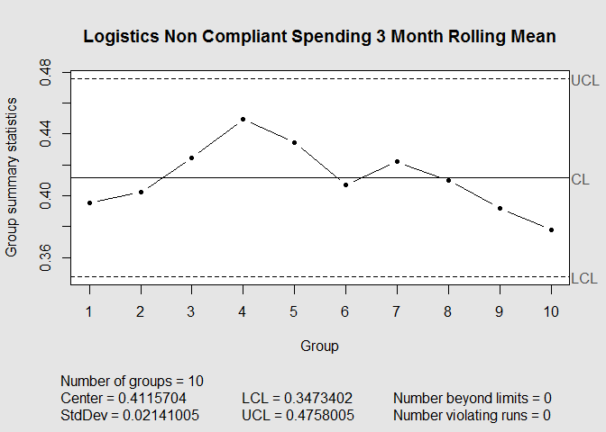

# Non Compliance Variation
#Non Compliant Spending Variation
The main question we want to have answered here is "How will we know when there's been real improvement?" Since that is fairly open ended, there's a couple things we can look at to give us an idea.

##The Quick and Dirty Approach
The simplest approach is to look at the current distribution of percent non-compliance and find what would be considered an "outlier". Given that we're looking at think in a fairly broad manner, instead of true outliers, we might consider relatively unlikely values to be "real change". We might consider a value at a 95th or even 90th percentile to be enough of a change. 

This method assumes that not only are the measurements independent from month to month but that they are approximately normally distributed. 

If these are roughlly normally distrubted, we can approximate that with a T-distribution and find the lower tail of a desired percentile. In the table below, for each type of non-compliant spending, I have reported the point where 5 and 10% of values are expected to fall below. 

Type | Mean | Standard Deviation | Five Percent | Ten Percent
-----|------|--------------------|--------------|------------
BPS|0.4539379|0.0487184|0.3664453|0.3875138
Logistics|0.4112787|0.0431754|0.3337406|0.352412
Real.Estate.and.Facilities|0.1530605|0.0282786|0.1022754|0.1145046

As for assuming normality, while we only have 12 data points to work with, I think we can get away with that assumption without too much of an issue. A Shapiro-Wilk test of normality resulted in fairly large p-values for each set, which at least means that we haven't ruled out that the data is from a normal distribution. We can also look at histograms to get a sense of it-
 

##Slightly More Complex Approach

Another (possibly better) approach would be to take a rolling 3 month mean (which we can assume is normally distributed because of the Central Limit Theorem) and then continue to find the 3 month mean to compare. This would be a good way to start a control chart as well.

 

 

 

I have these centered at the current mean of all the 3 month means. the UCL and LCL lines signify 3 standard deviations away from that mean. Should the next 3 month mean be outside of those lines, something **definitely** changed. However, that does not rule out any substantive change, as rolling means are purposefully change-resistant, and 3 standard deviations might be more than you really need. If you kept these continually for a while, you might be able to see a mean changing. Indeed, for con compliant facility spending, this seems to have happened- there is a distinct upward trend in the 3 month rolling average. 

We can make these charts without using the rolling mean as well, which might be a nice way of looking at things. 

 

 

 

There's more I could look into. Actually I'm pretty sure I know the best way of doing this, but I'd need to find a piece of paper and work through it a bit to see if it's actually any different than what I've already shown you.
